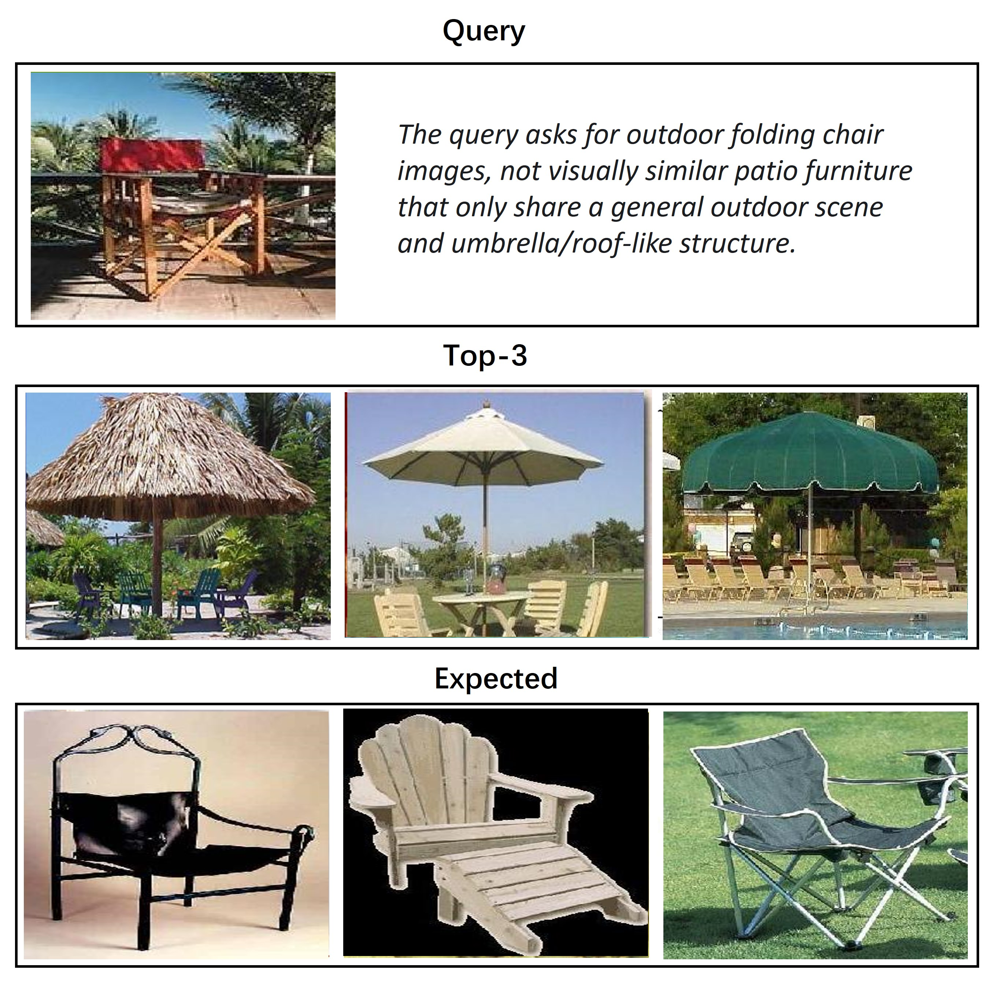
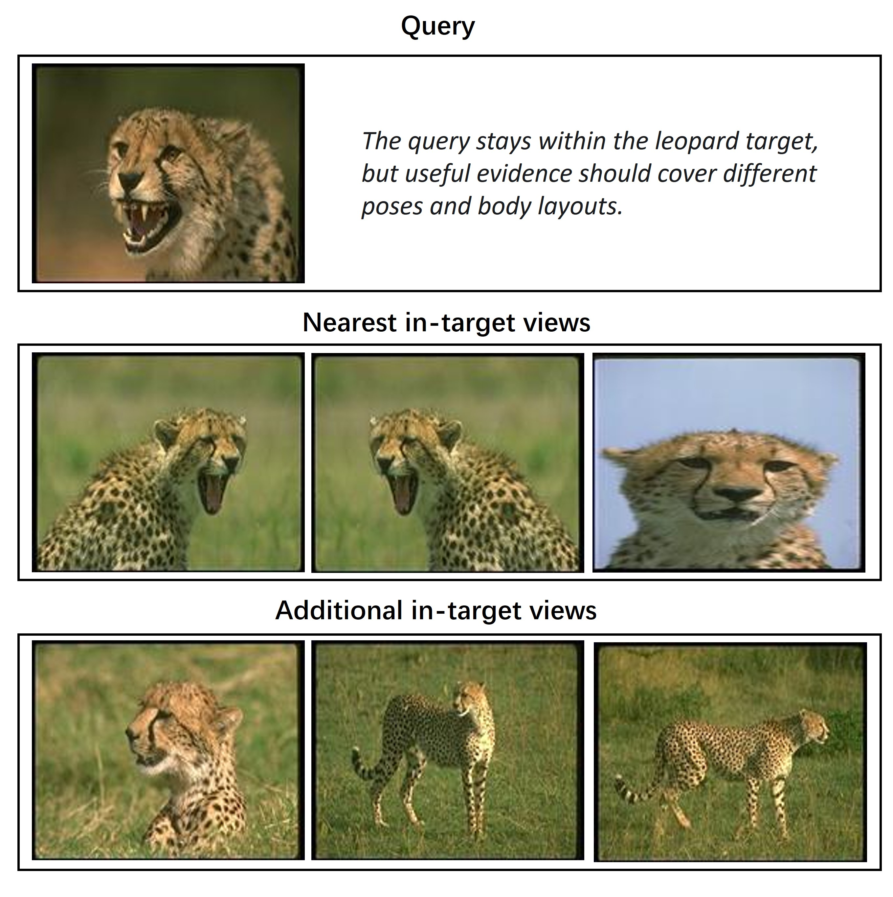
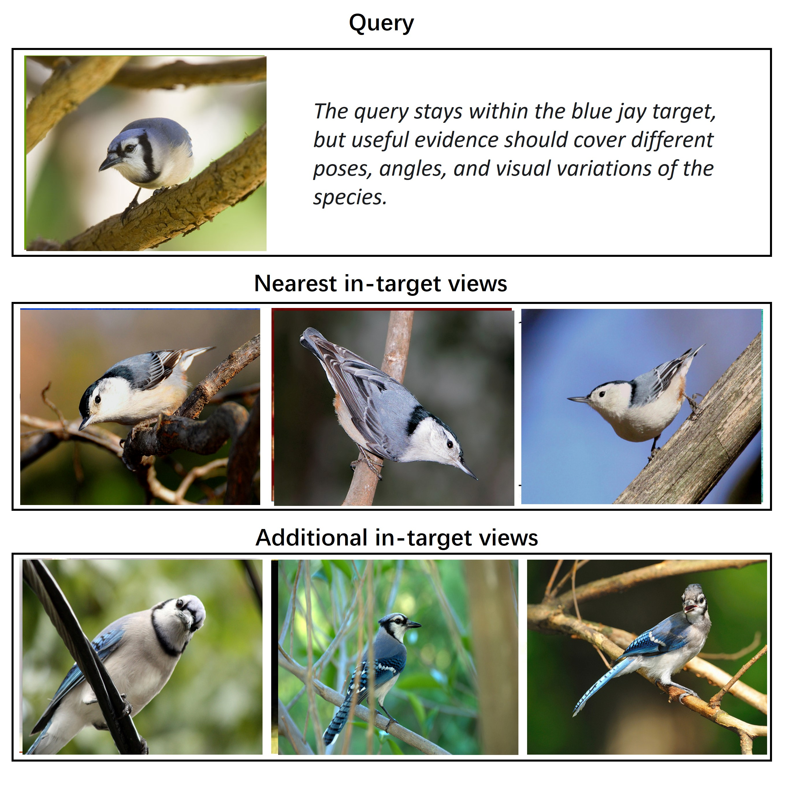
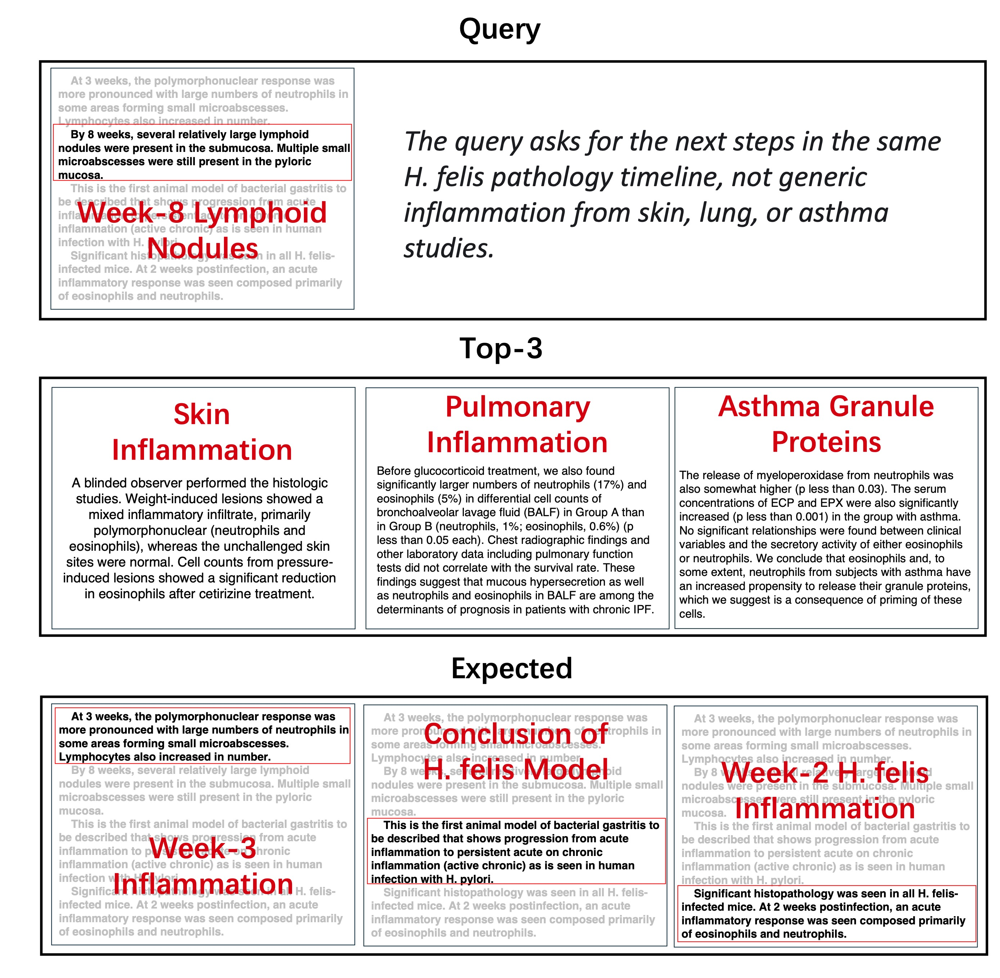

# Violas

**In-Memory Vector Group System for Semantic Search.**

[](LICENSE)
[](https://www.python.org/)
[](https://badge.fury.io/py/violas)

Violas is an in-memory retrieval framework for applications where a result is
more than one nearest embedding. It organizes vectors as semantic entities with
member observations, representative local regions, relevance links, and paired
modal evidence, then
uses HDMG to search those structured objects efficiently.

## Outline

- [Why Violas?](#why-violas)
- [Quick Start](#quick-start)
- [Typical Cases](#typical-cases)
- [How It Works](#how-it-works)
- [API Overview](#api-overview)
- [Installation Options](#installation-options)
- [Experiments](#experiments)
- [Reproducing Benchmarks](#reproducing-benchmarks)

## Why Violas?

Most vector search systems retrieve isolated embeddings. That works when
nearest-neighbor distance is the whole task, but many applications need richer
retrieval behavior:

- **Semantic-consistent retrieval**: retrieve results that stay consistent with the
  intended semantic entity. See [Entity Mismatch](#entity-mismatch).
- **Diversity-driven retrieval**: cover multiple poses, chunks, or local modes
  within the same entity. See [Diversity Loss](#diversity-loss).
- **Dependency-expanded retrieval**: expand a hit to linked context or temporal
  neighbors. See [Dependency Loss](#dependency-loss).
- **Cross-modal pairing**: keep text-image pairs inside the same
  retrieval object. See [Cross-Modal Evidence](#cross-modal-evidence).

Violas provides this behavior through `VectorGroup`, a semantic retrieval object
that keeps the entity, its members, local representatives, and relations in the
same searchable structure.

## Quick Start

Install the package in editable mode:

```bash
python -m venv .venv
source .venv/bin/activate
pip install -e .
```

If you want the packaged core library from PyPI later, the distribution name is
`violas`.

Run the minimal example. It uses synthetic vectors and does not require any
dataset, embedding model, or external vector database:

```bash
python examples/minimal_vectormap.py
```

Minimal API usage:

```python
import numpy as np

from violas import VectorMap

vectors = [np.random.rand(4) for _ in range(5)]
vm = VectorMap()
vm.create_group(
    key="example",
    group_name="demo",
    representative=np.mean(vectors, axis=0),
    rep_description="demo representative",
    vectors=vectors,
    descriptions=[{"text": f"item {i}"} for i in range(5)],
    vector_type="demo",
    group_type="synthetic",
)

query = np.random.rand(4)
results = vm.search_entity(query, key="example", top_k=3)
for rank, result in enumerate(results, start=1):
    text = result.group.descriptions[result.vector_idx]["text"]
    print(f"{rank}. key={result.key} distance={result.distance:.4f} text={text}")
```

## Typical Cases

The examples below correspond to the native capabilities evaluated in the
paper: semantic-consistent retrieval, diversity-driven retrieval,
dependency-expanded retrieval, and cross-modal pairing. We show them through
common flat-retrieval failure modes: entity mismatch, diversity loss,
dependency loss, and broken multimodal pairing. Entity mismatch is split into
two visible subcases: plausible mismatch, where the neighbor looks reasonable
but belongs to the wrong entity, and unjustified mismatch, where the neighbor
is close in embedding space without a clear semantic relation.

### Entity Mismatch

Flat nearest-neighbor search can drift into a different semantic entity. Violas
routes by semantic entity first, then ranks local members.

#### Plausible Entity Mismatch

Some wrong neighbors are visually or textually plausible because they share
coarse traits with the query, but they still violate the intended entity.

<table>
  <tr>
    <td width="50%" align="center" valign="top">
      <br>
      <sub>Rhinoceros: large-animal shape is not enough</sub>
    </td>
    <td width="50%" align="center" valign="top">
      <br>
      <sub>Anchor: abstract shape should not override entity meaning</sub>
    </td>
  </tr>
  <tr>
     <td width="50%" align="center" valign="top">
      <br>
      <sub>Platypus: coarse appearance is not enough</sub>
    </td>
    <td width="50%" align="center" valign="top">
      <br>
      <sub>Stegosaurus: semantic identity should dominate</sub>
    </td>
  </tr>
</table>


#### Unjustified Entity Mismatch

Some nearest neighbors are embedding-close without a clear category-level or
visual relation to the query. These cases expose a stronger form of entity
mismatch than visually plausible drift.

<table>
  <tr>
    <td width="50%" align="center" valign="top">
      <br>
      <sub>Ant: entity identity is not preserved</sub>
    </td>
    <td width="50%" align="center" valign="top">
      <br>
      <sub>Barrel: shape matches can cross entity boundaries</sub>
    </td>
  </tr>
  <tr>
    <td width="50%" align="center" valign="top">
      <br>
      <sub>Wristwatch: embedding proximity is not enough</sub>
    </td>
    <td width="50%" align="center" valign="top">
      <br>
      <sub>Chair: outdoor context should not override object identity</sub>
    </td>
  </tr>
</table>


### Diversity Loss

Even when the entity is correct, top results can be too redundant. Violas uses
representative local regions to expose different poses, viewpoints, chunks, or
scene layouts under the same semantic entity.

<table>
  <tr>
    <td width="50%" align="center" valign="top">
      <br>
      <sub>Bird: one entity, multiple useful views</sub>
    </td>
    <td width="50%" align="center" valign="top">
      <br>
      <sub>Airplane: cover flight configurations and scenes</sub>
    </td>
  </tr>
  <tr>
    <td width="50%" align="center" valign="top">
      <br>
      <sub>Leopard: cover poses and body layouts</sub>
    </td>
    <td width="50%" align="center" valign="top">
      <br>
      <sub>Blue jay: cover angles and species variations</sub>
    </td>
  </tr>
</table>


### Dependency Loss

Some useful answers require linked objects rather than a single nearest chunk.
In these OHSUMED cases, the middle segment is used as the query, while the
desired answer is the surrounding same-document evidence chain. Flat top-k
retrieval often returns isolated snippets that share surface vocabulary but
lose the dependency between setup, evidence, and conclusion.

<table>
  <tr>
    <td width="50%" align="center" valign="top">
      <br>
      <sub>Norfloxacin: trial evidence should be retrieved as a chain</sub>
    </td>
    <td width="50%" align="center" valign="top">
      <br>
      <sub>LPS antibody: abbreviation matches should keep the evidence chain</sub>
    </td>
  </tr>
  <tr>
    <td width="50%" align="center" valign="top">
      <br>
      <sub>Candidiasis: treatment choices need patient context</sub>
    </td>
    <td width="50%" align="center" valign="top">
      <br>
      <sub>H. felis: pathology timelines should stay connected</sub>
    </td>
  </tr>
</table>

### Cross-Modal Evidence

Some retrieval tasks need paired evidence across modalities, such as a caption
and its corresponding image. Violas keeps these modality links inside the same
retrieval object instead of reconstructing them after a flat vector search.

<table>
  <tr>
    <td width="50%" align="center" valign="top">
      <br>
      <sub>Sheet cake: text query aligned with image evidence</sub>
    </td>
    <td width="50%" align="center" valign="top">
      <br>
      <sub>Motorbike: scene-level text and image agreement</sub>
    </td>
  </tr>
  <tr>
    <td width="50%" align="center" valign="top">
      <br>
      <sub>Girl with cat: paired visual and caption evidence</sub>
    </td>
    <td width="50%" align="center" valign="top">
      <br>
      <sub>Candle: multimodal evidence keeps context intact</sub>
    </td>
  </tr>
</table>


## How It Works

### Retrieval Paradigm

<p align="center">
  
</p>

Violas changes the retrieval unit from an isolated vector to a structured
semantic entity. A query is first matched to the entity-level object, then
expanded to the members, local representatives, and linked evidence that belong
to that object.

### Vector Group

<p align="center">
  
</p>

`VectorGroup` is the structural unit behind Violas. Each group keeps:

- a semantic entity, represented by a key and semantic vector
- member observations associated with that entity
- representative local regions used for coverage-preserving search
- relevance links used for context-aware expansion

This lets Violas treat one semantic entity as a managed retrieval object instead
of a loose collection of isolated embeddings.

### HDMG Indexing

<p align="center">
  
</p>


On top of `VectorGroup`, Violas builds **HDMG** (Hierarchical Diversified Micro
Cluster Graph), an indexing mechanism for efficient semantic-first retrieval.
HDMG keeps search off the full flat object space by:

- routing into semantically compatible groups first
- traversing representative local regions instead of scanning all members
- preserving relevance expansion inside the same retrieval substrate

## API Overview

The public API follows the same workflow as the paper, but the names below are
the implemented Python methods rather than only paper pseudocode. The paper's
operations such as `insert(o)`, `update(o, e)`, and `delete(o)` correspond to
concrete `VectorMap` methods such as `VectorMap.insert()`,
`VectorMap.insert_object()`, `VectorMap.update()`, and `VectorMap.delete()`.

### Native Capability Map

| Native capability in the paper/evaluation | Implemented API | What it supports |
| --- | --- | --- |
| Semantic-consistent retrieval | `VectorMap.search_entity(...)`, `VectorMap.search(..., key=...)`, `VectorMap.insert(key, group, ...)` | Route retrieval through the intended semantic entity before member ranking. |
| Diversity-driven retrieval | `VectorMap.search_diverse(...)`, `VectorMap.search_with_representative_rerank(...)`, `VectorMap.create_cluster(...)` | Cover multiple micro-clusters or local forms inside the same entity. |
| Dependency-expanded retrieval | `VectorMap.search_dependency(...)`, `VectorMap.add_relation(...)`, `VectorMap.search_with_contextual_vectors(...)` | Expand a seed hit to linked context, temporal neighbors, or relation targets. |
| Cross-modal pairing | `VectorMap.search_modal(...)`, `VectorMap.search_multimodal(...)`, `VectorMap.add_pair_relation(...)` | Keep paired image-text or multimodal evidence inside the retrieval object. |

### 1. Object and Group Lifecycle

| API | Typical use | Notes |
| --- | --- | --- |
| `VectorMap.insert(key, group, metadata=None)` | Register a `VectorGroup` under a semantic key. | Implemented group-level insert used by the core storage path. |
| `VectorMap.insert_object(key, vector, description)` | Insert one object and return a `VectorRef`. | Object-level wrapper for paper-style `insert(o)`. |
| `VectorMap.update(ref, vector=None, description=None)` | Update one object's embedding or metadata. | Paper-style `update(o, e)` alias backed by `update_object(...)`. |
| `VectorMap.delete(ref)` | Remove one object by `VectorRef`. | Paper-style `delete(o)` alias backed by `delete_object(...)`. |
| `VectorMap.assign(ref, key, group_name=None)` | Move one object into another semantic entity. | Paper-style assignment alias backed by `assign_object(...)`. |
| `VectorMap.create_group(key, vectors, descriptions)` | Create a semantic group from member objects. | Builds a `VectorGroup` and registers it with `VectorMap.insert(...)`. |
| `VectorMap.create_cluster(key, group, alpha=0.5)` | Build micro-clusters under a semantic entity. | Paper-style `create.cluster()` wrapper around auto clustering. |
| `VectorGroup(...)` | Create a retrieval unit with a representative vector, member vectors, and descriptions. | Use one group for one semantic entity, document, event, or paired object. |
| `VectorMap.insert_with_auto_cluster(key, group, alpha=0.5)` | Split a large group into representative local regions. | Useful when an entity has many views, chunks, or modes. |
| `VectorMap.add_vector(vector, description)` | Append one item to an existing group. | The description should include `key` and `group_name`. |
| `VectorMap.add_vector_list(vectors, descriptions)` | Batch append items and create context ids. | Convenient for chunked documents or ordered evidence. |
| `VectorMap.update_object(ref, vector=None, description=None)` | Update one object's embedding or metadata. | Original explicit method kept for backward compatibility. |
| `VectorMap.assign_object(ref, key, group_name=None)` | Move one object into another semantic group. | Original explicit method kept for backward compatibility. |
| `VectorMap.delete_object(ref)` | Remove one object by `VectorRef`. | Original explicit method kept for backward compatibility. |

### 2. Attach Semantic Signals

| API | Typical use | Notes |
| --- | --- | --- |
| `VectorMap.set_key_vectors(key_vectors)` | Provide semantic vectors for keys such as classes, entities, or document ids. | Enables mixed semantic-vector retrieval. |
| `VectorMap.set_key_vectors_from_predictor(predictor)` | Import key vectors from a predictor object. | The predictor is expected to expose `keys` and `text_features`. |
| `VectorMap.get_key_vector(key)` | Resolve the semantic vector for a key or clustered subkey. | Handles keys such as `rhino-0001` by mapping back to `rhino`. |

### 3. Build Search Indexes

| API | Typical use | Notes |
| --- | --- | --- |
| `VectorMap.build_index()` | Build local indexes for representative and single-vector search. | Uses FAISS when available and falls back to exact search otherwise. |
| `VectorMap.build_rep_index()` | Build only the representative-vector index. | Useful for group-level candidate generation. |
| `VectorMap.build_single_index()` | Build only the member-vector index. | Useful for flat item-level lookup. |
| `VectorMap.build_hdmg(embedding_k=16, semantic_intra_k=4, ...)` | Build HDMG over semantically attached representatives. | This is the fast path for mixed semantic-vector search. |
| `VectorMap.get_last_hdmg_search_stats()` | Inspect the previous HDMG query. | Helpful for debugging visited nodes and graph traversal behavior. |

### 4. Native Query Capabilities

| API | Native capability | Result behavior |
| --- | --- | --- |
| `VectorMap.search_entity(query_vector, key=...)` | Semantic-consistent retrieval. | Routes or scopes retrieval by entity before local ranking. |
| `VectorMap.search_diverse(query_vector, query_key_vector=None, beta=0.5)` | Diversity-driven retrieval. | Uses HDMG when built, otherwise representative reranking. |
| `VectorMap.search_dependency(query_vector, relation_types=..., hops=1)` | Dependency-expanded retrieval. | Follows relation-aware search or local context expansion. |
| `VectorMap.search_modal(query_vectors, modality_weights=...)` | Cross-modal pairing. | Fuses image, text, or other modality vectors. |
| `VectorMap.search(query_vector, top_k=5, key=None, mode="single")` | Standard vector search, optionally scoped to one key. | Returns `SearchResult` objects with distance, key, group, and vector index. |
| `VectorMap.search_with_rep_vec(query_vector, top_k=5)` | Search group representatives. | Good for routing to entity-level candidates. |
| `VectorMap.search_with_representative_rerank(query_vector, query_key_vector=None, beta=0.5)` | Use representatives first, then rerank with semantic information. | Useful when quality matters more than raw flat search speed. |
| `VectorMap.search_with_mixed_key_rep_vec(query_vector, query_key_vector, beta=0.5)` | Combine semantic-key relevance and representative-vector relevance. | `beta` controls the semantic vs. embedding tradeoff. |
| `VectorMap.search_hdmg(query_vector, query_key_vector=None, alpha=0.5, top_k=5)` | Run graph-based semantic-vector retrieval. | Recommended for scalable mixed retrieval. |

### 5. Lower-Level Relations, Context, and Multimodal Retrieval

| API | Query pattern | Result behavior |
| --- | --- | --- |
| `VectorRef` | Address one vector inside a key/group/index location. | Used to build explicit links between items. |
| `VectorRelation` | Store typed relations such as context, pair, parent-child, or temporal links. | Lets retrieval expand beyond one isolated hit. |
| `VectorMap.add_relation(source, target, relation_type)` | Add an object-level dependency. | Supports context, temporal, parent-child, and cross-modal links. |
| `VectorMap.remove_relation(source, target=None, relation_type=None)` | Remove stored dependencies. | Can remove all relations from one source object or a filtered relation target. |
| `VectorMap.add_pair_relation(key, group1_id, group2_id)` | Link paired groups, such as image-caption or query-answer groups. | Supports paired evidence retrieval. |
| `VectorMap.add_tree_relation(key, parent_name, child_name)` | Store hierarchical relations. | Useful for document sections, taxonomy, or structured records. |
| `VectorMap.search_with_contextual_vectors(query_vector, num=2)` | Search and include nearby context vectors. | Works well for chunked documents and dialogue histories. |
| `VectorMap.get_contextual_vectors(result, num=2)` | Expand an existing result with its neighbors. | Turns one hit into a small evidence bundle. |
| `VectorMap.search_with_relations(query_vector, relation_types=...)` | Search while following explicit stored relations. | Returns relation-aware results. |
| `VectorMap.search_multimodal(query_vectors, modality_weights=...)` | Fuse several query vectors or modalities. | Useful when one entity has image, text, or other views. |
| `VectorMap.get_statistics()` / `VectorMap.analyze_relationships()` | Inspect storage and relation coverage. | Useful for dataset checks and benchmark reporting. |

Example: group-scoped retrieval for a known entity:

```python
results = vm.search(query_vector, key="rhino", top_k=5)
```

Example: mixed semantic-vector retrieval with HDMG:

```python
vm.set_key_vectors(key_vectors)
vm.build_hdmg()

results = vm.search_hdmg(
    query_vector=image_embedding,
    query_key_vector=semantic_embedding,
    alpha=0.5,
    top_k=5,
)
```

Example: expand a hit into contextual evidence:

```python
base_results = vm.search(query_vector, top_k=1)
context_bundle = vm.get_contextual_vectors(base_results[0], num=2)
```

For a broader overview of supported retrieval patterns, see
[docs/api.md](docs/api.md).

## Installation Options

The full benchmark suite uses several optional backends. For quick library
experiments, install only the minimal dependencies shown above.

For the full benchmark environment:

```bash
pip install -r requirements.txt
pip install -e .
```

Alternatively, use the full benchmark requirements file:

```bash
pip install -r requirements.txt
```

The full benchmark dependencies include optional-heavy packages such as CLIP,
Sentence-Transformers, FAISS, Milvus Lite, Qdrant, and Chroma because the
benchmark suite compares Violas with external vector database baselines.

## Repository Layout

```text
Violas/
  violas/
    storage/       # VectorMap, VectorGroup, relation helpers
    core/          # feature helpers, recall utilities, baseline indexes
  benchmarks/      # six benchmark pipelines plus diversity cases
  examples/        # small runnable examples
  scripts/         # benchmark wrapper scripts
  docs/            # API notes, data formats, benchmark results, case studies
```

## Experiments


Violas is evaluated on six vision and text benchmarks under the mixed
semantic-vector retrieval objective described in the paper. At the balanced
setting (`beta = 0.5`), the system delivers high retrieval quality with low
latency across all datasets.

| Dataset | HDMG Recall@3 | HDMG Latency (ms) | Representative Recall@3 | Representative Latency (ms) | Milvus Recall@3 | Milvus Latency (ms) |
| --- | ---: | ---: | ---: | ---: | ---: | ---: |
| Caltech-101 | 0.9985 | 3.06 | 1.0000 | 131.53 | 0.8972 | 15.94 |
| CUB-200-2011 | 1.0000 | 2.91 | 1.0000 | 163.91 | 0.5253 | 15.69 |
| COCO | 0.9965 | 1.49 | 1.0000 | 115.75 | 0.6625 | 4.97 |
| 20 Newsgroups | 0.9987 | 2.50 | 0.9715 | 81.89 | 0.7832 | 5.16 |
| OHSUMED | 0.9809 | 2.71 | 0.9226 | 62.44 | 0.4586 | 4.57 |
| Yahoo Answers | 1.0000 | 2.94 | 0.9507 | 58.56 | 0.6132 | 5.23 |

What this shows:

- HDMG reaches near-perfect retrieval quality on every benchmark at `beta = 0.5`.
- Representative reranking remains accurate but is substantially slower than HDMG.
- Pure-vector baselines are competitive at `beta = 0.0`, but degrade once
  semantic control matters.

The benchmark environment uses an Intel Xeon Platinum 8350C CPU (2.60 GHz),
16 CPU cores, and 64 GB RAM. Image embeddings use CLIP ViT-B/32 and text
embeddings use Sentence-Transformers all-MiniLM-L6-v2 in the benchmark
pipelines.

More details:

- [Benchmark Results](docs/results.md)
- [Benchmark Notes](docs/benchmark.md)
- [Data Format](docs/data_format.md)

## Reproducing Benchmarks

The shell scripts assume a workspace where `Violas/` and `dataset/` are
siblings. Override the dataset variables if your data lives elsewhere.

```bash
bash scripts/run_bench_all.sh
bash scripts/run_bench_vision.sh
bash scripts/run_bench_text.sh
bash scripts/run_diversity_case.sh
```

Vision dataset variables:

- `CALTECH_ROOT`
- `CUB_ROOT`
- `COCO_ROOT`
- `COCO_JSON`

Text dataset variables:

- `NEWS20_ROOT`
- `OHSUMED_ROOT`
- `YAHOO_ROOT`

Saved artifacts are written under `outputs/<benchmark>/` by default. External
vector database baselines are disabled by default for portability. To enable
them:

```bash
export VIOLAS_ENABLE_EXTERNAL_DBS=1
```
