# Benchmark Results

This page summarizes the six benchmark suites bundled with Violas:

- Caltech-101
- CUB-200-2011
- COCO
- 20 Newsgroups
- OHSUMED
- Yahoo Answers

Unless otherwise noted, the figures below report smooth beta sweeps over:

- `Recall@3`
- `NDCG@3`
- average latency per query in milliseconds

The tables focus on three representative beta settings:

- `beta = 0.0`: embedding-dominant retrieval
- `beta = 0.5`: balanced semantic-vector retrieval
- `beta = 1.0`: semantic-dominant retrieval

## Combined Overview

## Headline Observations

- HDMG reaches near-perfect or perfect retrieval quality on all six datasets once semantic weighting is introduced.
- Representative reranking is highly accurate but substantially slower than HDMG.
- External pure-vector baselines are competitive at `beta = 0.0`, but they degrade sharply when the task requires semantic control.
- The latency advantage of HDMG is consistent across both vision and text benchmarks.

## Caltech-101

| Recall@3 | NDCG@3 | Latency |
| --- | --- | --- |
| 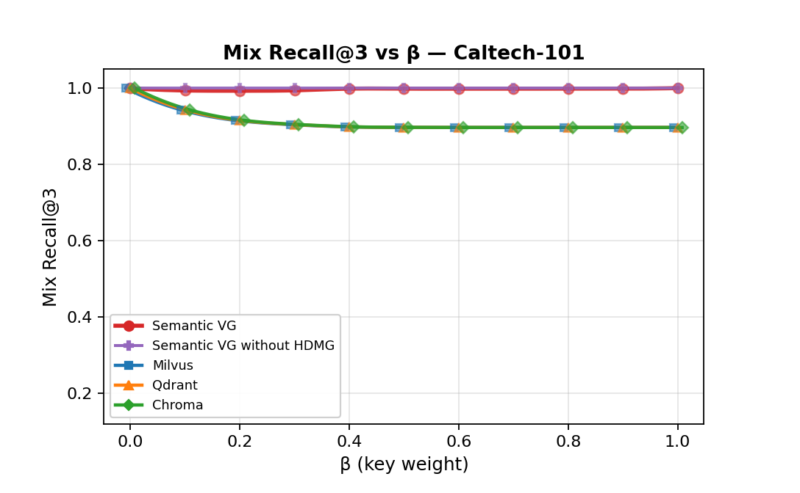 | 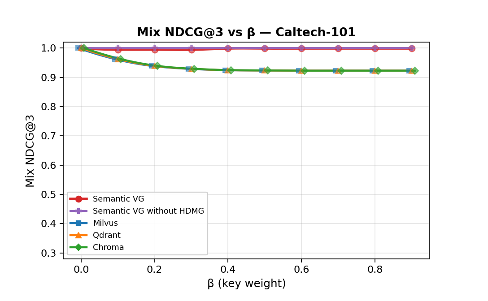 | 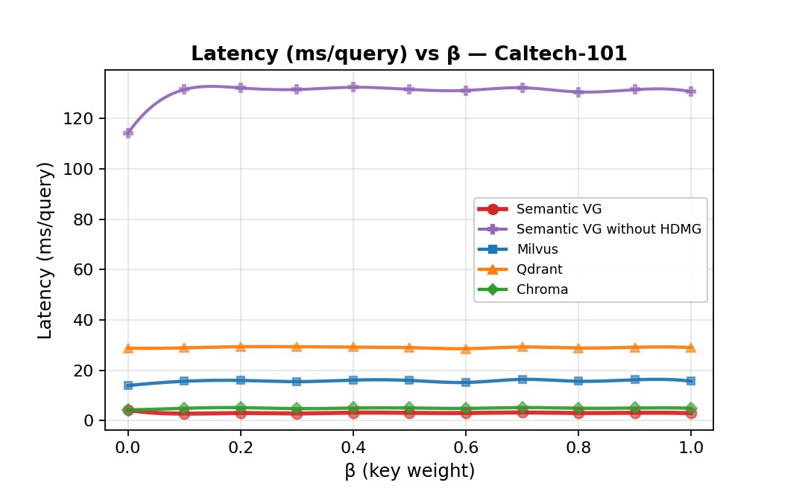 |

| Method | Recall@3 (`beta=0.0`) | Recall@3 (`beta=0.5`) | Recall@3 (`beta=1.0`) | Latency ms/query (`beta=0.5`) |
| --- | ---: | ---: | ---: | ---: |
| HDMG (ours) | 0.9901 | 0.9985 | 1.0000 | 3.06 |
| Representative | 1.0000 | 1.0000 | 1.0000 | 131.53 |
| Milvus | 1.0000 | 0.8972 | 0.8968 | 15.94 |
| Qdrant | 1.0000 | 0.8972 | 0.8968 | 28.96 |
| Chroma | 1.0000 | 0.8972 | 0.8968 | 5.00 |

Caltech is already easy for embedding-only search at `beta=0.0`, but the
balanced setting still preserves near-perfect quality while keeping HDMG much
faster than representative reranking.

## CUB-200-2011

| Recall@3 | NDCG@3 | Latency |
| --- | --- | --- |
| 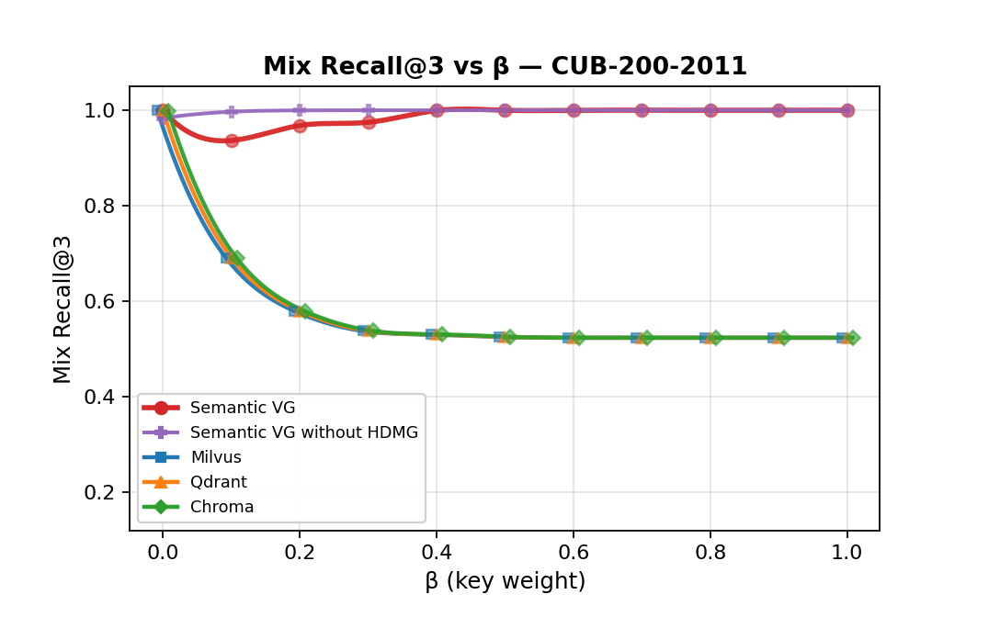 | 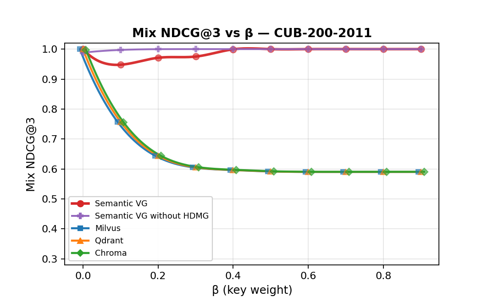 | 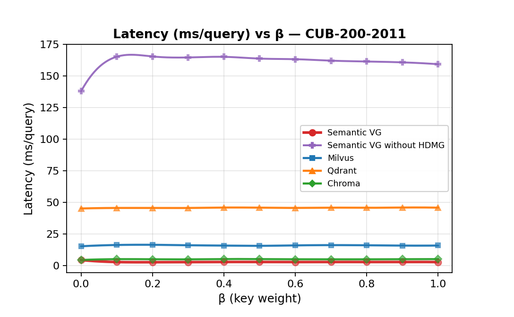 |

| Method | Recall@3 (`beta=0.0`) | Recall@3 (`beta=0.5`) | Recall@3 (`beta=1.0`) | Latency ms/query (`beta=0.5`) |
| --- | ---: | ---: | ---: | ---: |
| HDMG (ours) | 0.8452 | 1.0000 | 1.0000 | 2.91 |
| Representative | 0.9832 | 1.0000 | 1.0000 | 163.91 |
| Milvus | 1.0000 | 0.5253 | 0.5236 | 15.69 |
| Qdrant | 1.0000 | 0.5253 | 0.5236 | 45.91 |
| Chroma | 0.9980 | 0.5256 | 0.5239 | 5.18 |

CUB highlights the value of semantic control most clearly: pure-vector baselines
start strong, but mixed retrieval is required to recover the intended category
and viewpoint structure.

## COCO

| Recall@3 | NDCG@3 | Latency |
| --- | --- | --- |
| 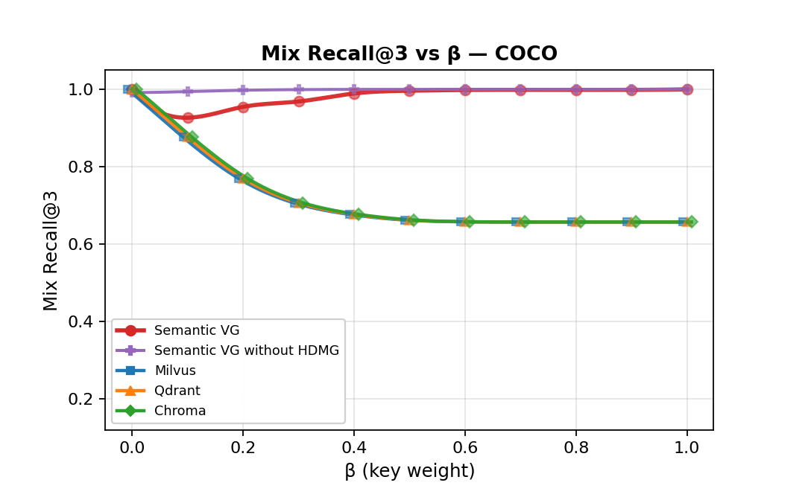 | 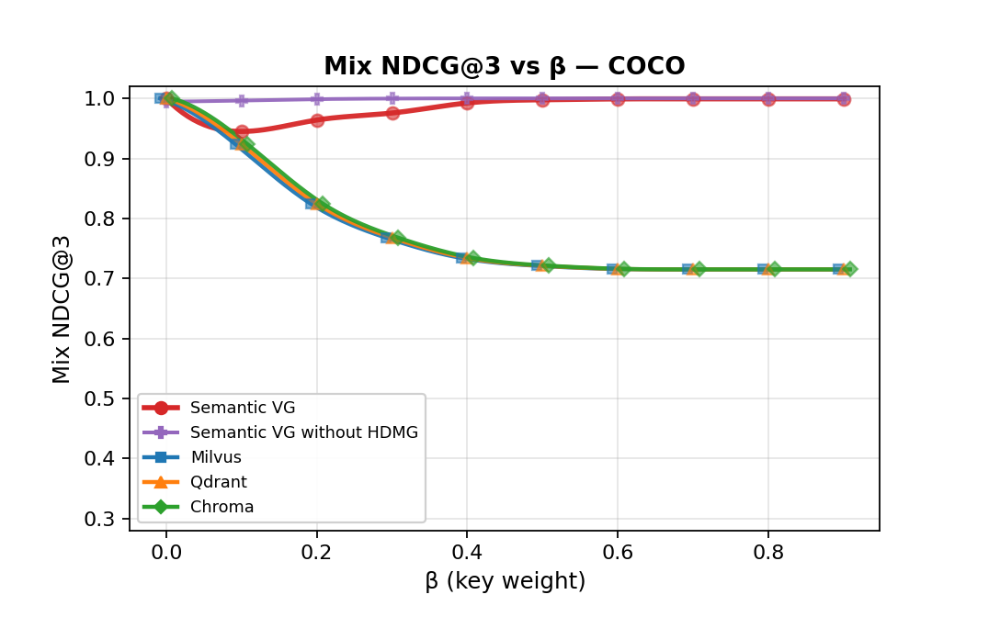 | 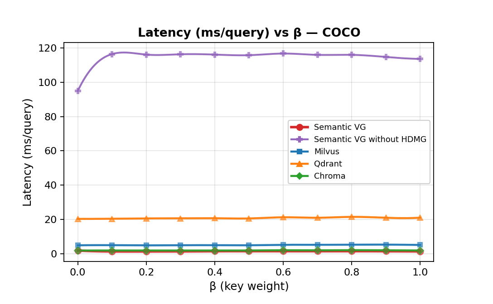 |

| Method | Recall@3 (`beta=0.0`) | Recall@3 (`beta=0.5`) | Recall@3 (`beta=1.0`) | Latency ms/query (`beta=0.5`) |
| --- | ---: | ---: | ---: | ---: |
| HDMG (ours) | 0.8993 | 0.9965 | 1.0000 | 1.49 |
| Representative | 0.9916 | 1.0000 | 1.0000 | 115.75 |
| Milvus | 1.0000 | 0.6625 | 0.6573 | 4.97 |
| Qdrant | 1.0000 | 0.6625 | 0.6573 | 20.60 |
| Chroma | 1.0000 | 0.6625 | 0.6573 | 1.94 |

On COCO, HDMG reaches near-perfect retrieval quality with a latency budget below
2 ms/query at the balanced setting, while representative reranking remains two
orders of magnitude slower.

## 20 Newsgroups

| Recall@3 | NDCG@3 | Latency |
| --- | --- | --- |
| 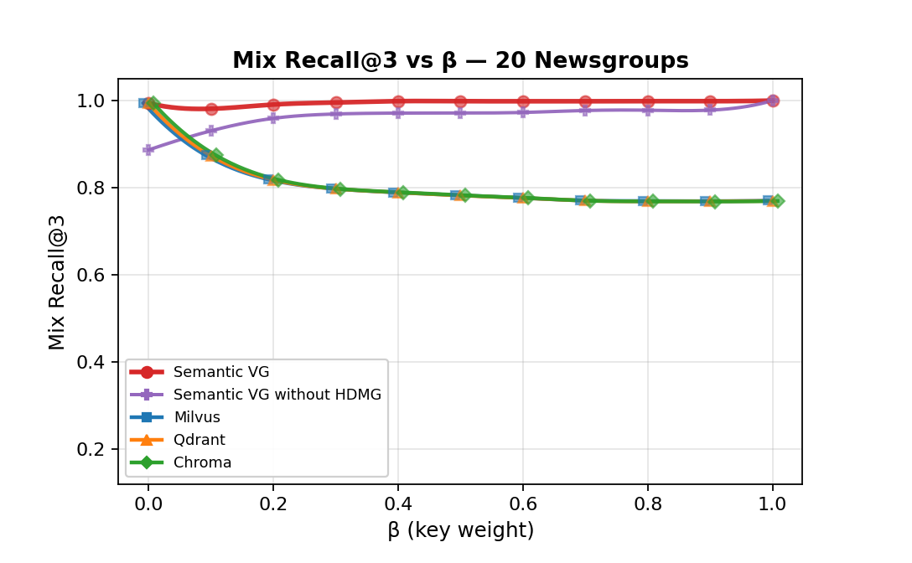 | 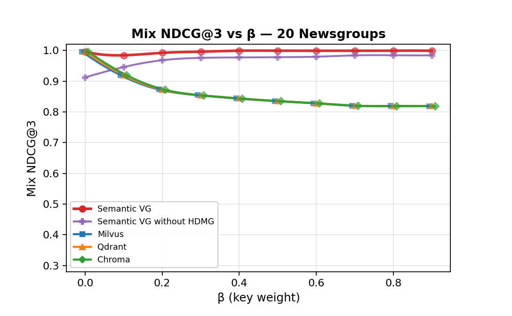 | 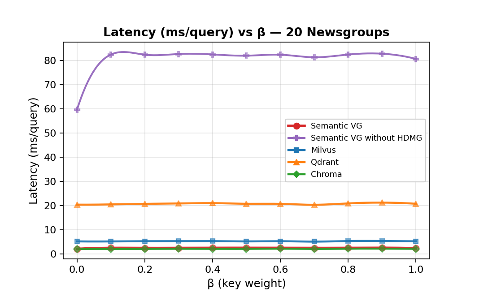 |

| Method | Recall@3 (`beta=0.0`) | Recall@3 (`beta=0.5`) | Recall@3 (`beta=1.0`) | Latency ms/query (`beta=0.5`) |
| --- | ---: | ---: | ---: | ---: |
| HDMG (ours) | 0.9647 | 0.9987 | 1.0000 | 2.50 |
| Representative | 0.8868 | 0.9715 | 1.0000 | 81.89 |
| Milvus | 0.9943 | 0.7832 | 0.7705 | 5.16 |
| Qdrant | 0.9937 | 0.7823 | 0.7698 | 20.70 |
| Chroma | 0.9935 | 0.7823 | 0.7697 | 2.07 |

The text benchmarks show the same trend as the vision datasets: once retrieval
must respect semantic-key structure, HDMG retains high quality with modest
latency while pure-vector baselines fall off.

## OHSUMED

| Recall@3 | NDCG@3 | Latency |
| --- | --- | --- |
| 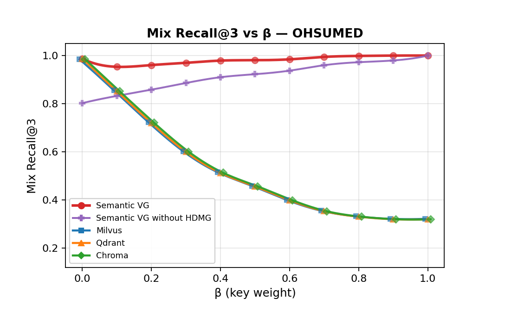 | 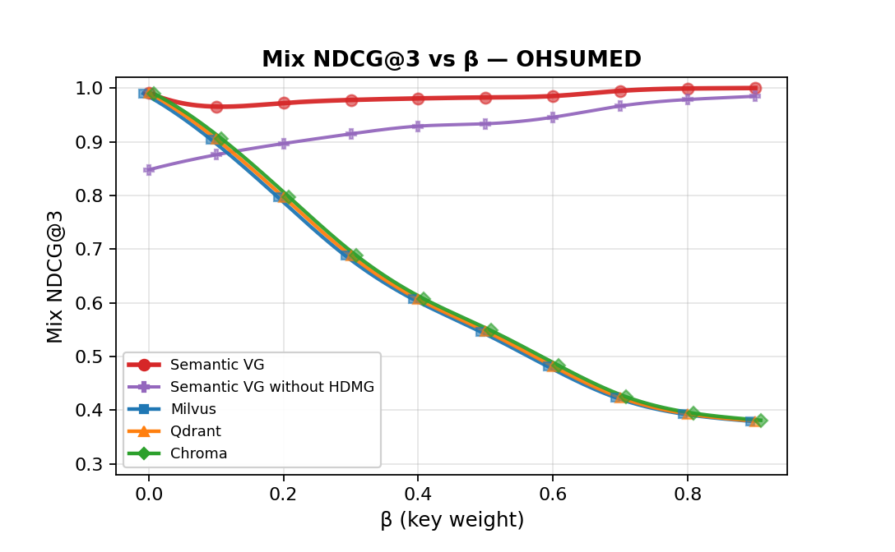 | 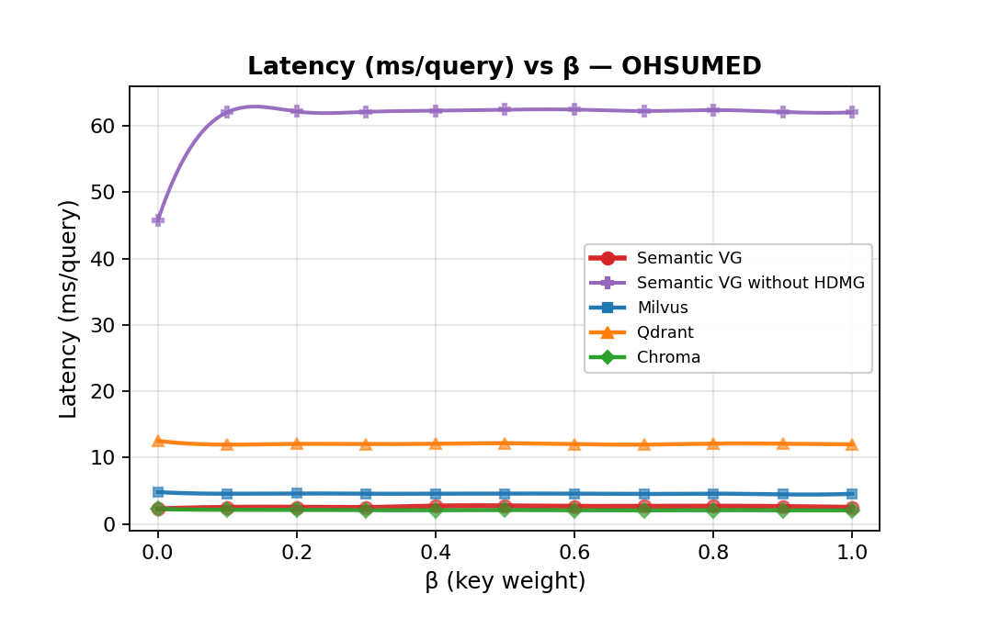 |

| Method | Recall@3 (`beta=0.0`) | Recall@3 (`beta=0.5`) | Recall@3 (`beta=1.0`) | Latency ms/query (`beta=0.5`) |
| --- | ---: | ---: | ---: | ---: |
| HDMG (ours) | 0.9354 | 0.9809 | 1.0000 | 2.71 |
| Representative | 0.8023 | 0.9226 | 1.0000 | 62.44 |
| Milvus | 0.9846 | 0.4586 | 0.3220 | 4.57 |
| Qdrant | 0.9872 | 0.4562 | 0.3203 | 12.16 |
| Chroma | 0.9855 | 0.4565 | 0.3203 | 2.09 |

OHSUMED is one of the clearest semantic retrieval cases in the repository. The
gap between HDMG and pure-vector baselines widens rapidly as beta increases.

## Yahoo Answers

| Recall@3 | NDCG@3 | Latency |
| --- | --- | --- |
| 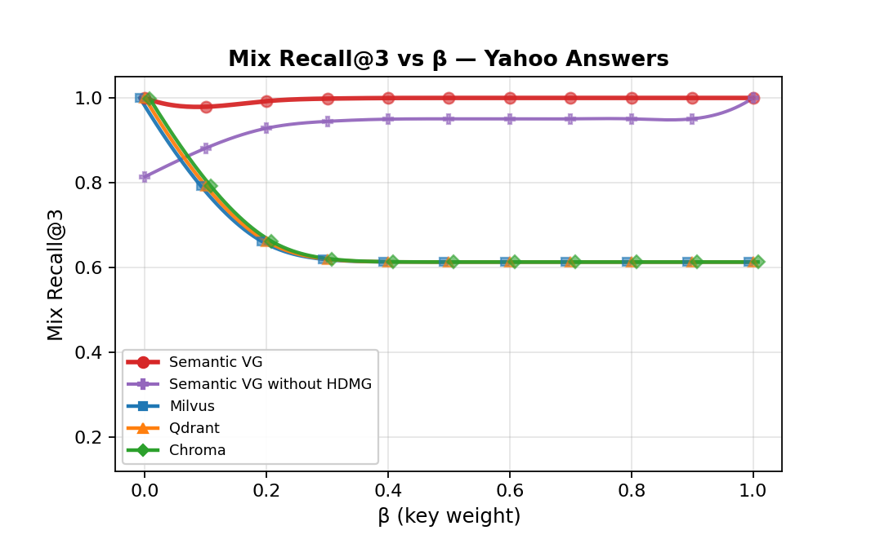 | 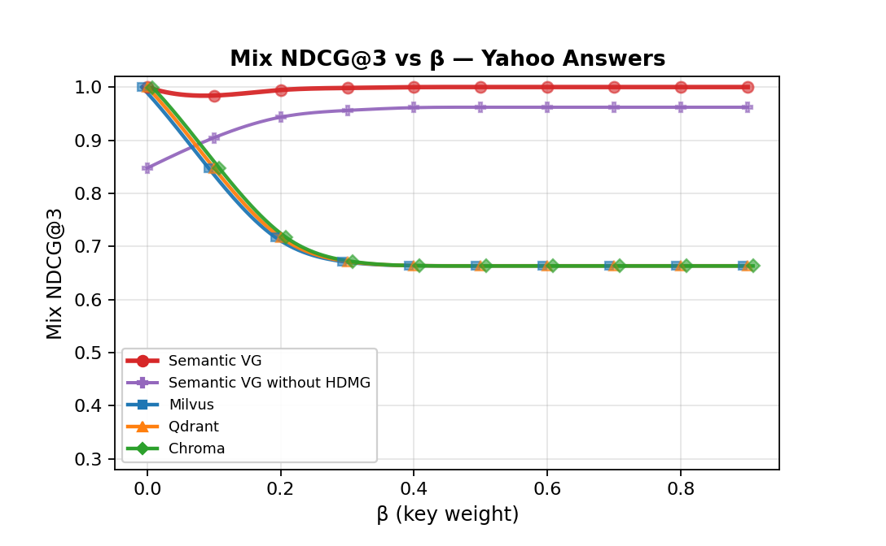 | 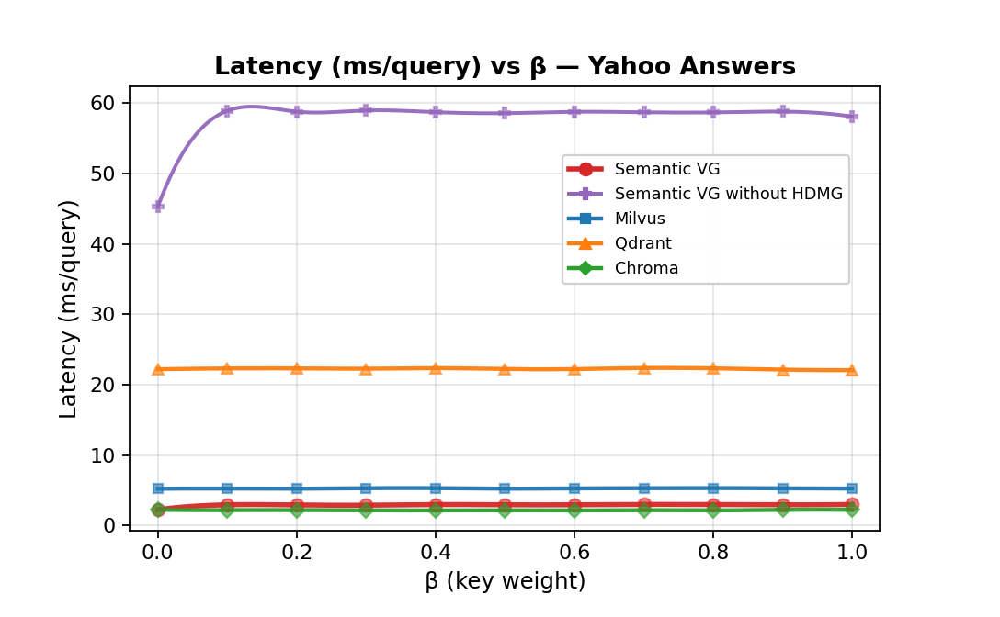 |

| Method | Recall@3 (`beta=0.0`) | Recall@3 (`beta=0.5`) | Recall@3 (`beta=1.0`) | Latency ms/query (`beta=0.5`) |
| --- | ---: | ---: | ---: | ---: |
| HDMG (ours) | 0.9493 | 1.0000 | 1.0000 | 2.94 |
| Representative | 0.8142 | 0.9507 | 1.0000 | 58.56 |
| Milvus | 1.0000 | 0.6132 | 0.6132 | 5.23 |
| Qdrant | 1.0000 | 0.6132 | 0.6132 | 22.23 |
| Chroma | 0.9986 | 0.6132 | 0.6132 | 2.16 |

Yahoo Answers follows the same pattern as OHSUMED and 20 Newsgroups: semantic
mixing is the dominant factor for recall, and HDMG achieves that gain without
the latency cost of exhaustive representative reranking.

## Reproducing The Results

The repository exposes the same benchmark entry points used to produce these
artifacts:

- `bash scripts/run_bench_all.sh`
- `bash scripts/run_bench_vision.sh`
- `bash scripts/run_bench_text.sh`

See [benchmark.md](benchmark.md) for the benchmark entry points and output
conventions.
